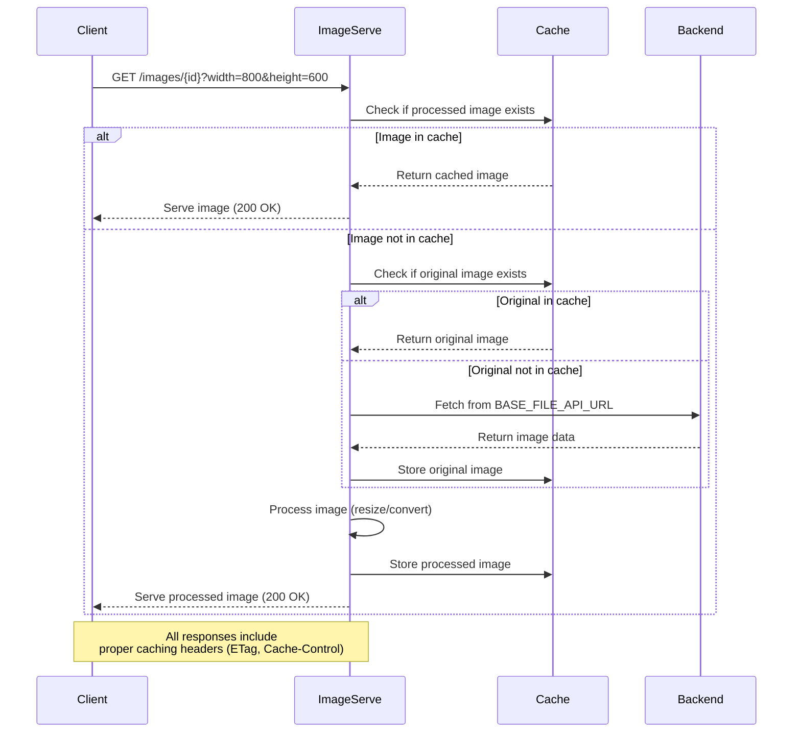

# imgr-serve

Service for serving static images with automatic resizing and caching. Designed for small to medium projects, this service handles all image delivery routines, automatically resizing images based on width and height parameters passed from your frontend.

## Overview

imgr-serve is a single-node image proxy service that automatically resizes images on-the-fly, converts formats, and provides efficient caching. It's designed to offload image processing and delivery from your main application, reducing server load and improving response times.

**Example Usage:**
```bash
# Request an image with automatic resizing (outputs WebP)
curl "http://localhost:3021/images/photo123?width=800&height=600"

# Preload an image into cache (requires API key)
curl -X PUT "http://localhost:3021/images/photo123" \
  -H "X-API-Key: your-api-key" \
  --data-binary @image.jpg
```

**Example Output:** Optimized WebP image with proper caching headers, served directly to the client.

## Getting Started

### Quick Start with Docker Compose

1. **Clone the repository:**
```bash
git clone <repository-url>
cd imgr-serve
```

2. **Create environment file:**
```bash
cp .env.example .env
# Edit .env with your configuration
```

3. **Start the service:**
```bash
docker-compose up -d
```

4. **Test the service:**
```bash
# Health check
curl http://localhost:3021/

# Request an image (if BASE_FILE_API_URL is configured)
curl "http://localhost:3021/images/your-image-id.jpg?width=800&height=600"
```

### Manual Build

1. **Install Rust:**
```bash
curl --proto '=https' --tlsv1.2 -sSf https://sh.rustup.rs | sh
```

2. **Build the project:**
```bash
cargo build --release
```

3. **Run the service:**
```bash
# Set environment variables
export HOST=0.0.0.0
export PORT=3021
export API_KEY=your-secret-key

# Run
./target/release/imgr-serve
```

## How It Works



## Features

- **Automatic Image Resizing**: Resize images on-the-fly using `width` and `height` query parameters
- **Format Conversion**: Automatically convert images to WebP format for optimal delivery
- **Smart Caching**: Multi-layer caching with in-memory and persistent disk storage options
- **Request Proxying**: Automatically fetch images from your backend API when not in cache
- **Aspect Ratio Control**: Control how images are resized with `ratio_policy` parameter (resize, crop_center)
- **Preloading**: Preload images into cache via authenticated API endpoint
- **Production Ready**: Proper caching headers (ETag, Cache-Control), correct MIME types, and browser-side caching
- **Flexible Configuration**: Configure via environment variables for different deployment scenarios

## Configuration

The service is configured via environment variables. See `.env.example` for all available options:

- `HOST`: Server bind address (default: `0.0.0.0`)
- `PORT`: Server port (default: `3021`)
- `API_KEY`: Secret key for preloading images
- `BASE_FILE_API_URL`: Backend API URL for fetching images (optional)
- `STORAGE_IMPLEMENTATION`: `InMemory` or `Persistent` for original images
- `PROCESSING_CACHE_IMPLEMENTATION`: `InMemory` or `Persistent` for processed images
- `STORAGE_CACHE_SIZE`: Number of original images to cache (default: 256)
- `PROCESSING_CACHE_SIZE`: Number of processed images to cache (default: 1024)

## API Endpoints

### GET `/images/{id}`

Serve an image with optional processing parameters.

**Query Parameters:**
- `width`: Target width in pixels
- `height`: Target height in pixels
- `ratio_policy`: How to handle aspect ratio differences (`resize` or `crop_center`)

**Example:**
```bash
GET /images/photo123.jpg?width=800&height=600&ratio_policy=crop_center
```

### PUT `/images/{id}`

Preload an image into cache. Requires `X-API-Key` header.

**Headers:**
- `X-API-Key`: Your configured API key

**Example:**
```bash
PUT /images/photo123.jpg
X-API-Key: your-secret-key
Content-Type: image/jpeg

[image binary data]
```

## Architecture

This microservice is designed as a single-node solution, but can work with shared storage backends (database, Redis, S3) in future versions. The current implementation uses:

- **In-memory caching**: Fast access for frequently requested images
- **Persistent disk storage**: Optional fjall embedded database for durable caching
- **On-the-fly processing**: Images are processed as needed and cached for subsequent requests

## Development

### Building

```bash
cargo build --release
```

### Running Tests

```bash
cargo test
```

### Docker Build

```bash
docker build -t imgr-serve:latest .
```

## Production Deployment

The service includes Docker and Docker Compose configurations for easy deployment. GitHub Actions automatically builds and publishes Docker images to GitHub Container Registry on pushes to main branch and version tags.

**Using the published image:**
```yaml
services:
  imgr-serve:
    image: ghcr.io/your-org/imgr-serve:latest
    # ... rest of configuration
```

## Feature Roadmap

- [x] Support for request proxying to image sources
    - When an image is not in cache, we fetch it from the primary backend
- [x] Serve static content (images only), with input file validation support
- [x] Automatically convert images to requested format
    - Just specify the format in the URL (e.g., https://<server>/<image_id>.<extension>)
- [x] Support on-the-fly image scaling
    - Default behavior - resize to specified dimensions using `width`, `height` parameters
- [ ] ~~Also support cropping, by specifying `mode=crop` parameter~~
    - Different approach implemented instead
- [x] Automatically configure proper static content delivery
    - Caching headers (ETag)
    - Browser-side caching (TTL)
    - Correct MIME types
- [x] In-memory caching
- [x] Disk caching?
    - ~~Cache by hashing all parameters into filenames,~~ implemented fjall embedded database instead (more efficient than direct file operations)
    - Enables fast disk data retrieval
- [x] Support for preloading images (via auth token)
- [x] Ready Docker image and usage examples in compose
- [ ] Swagger/OpenAPI documentation
- [ ] Clear and documented error messages
- [x] Flexible configuration via .env
    - Compression level settings
    - x Cache size settings (by image count, by variation count)
    - x Enable/disable disk caching
- [x] Clear README with quick start and all configuration explanations
    - Separate explanations for disk caching
- [ ] Support S3 as backend for persistent file storage
    - Note: Might not be optimal; on-the-fly cache processing likely faster
    - Also implies S3 as proxy source backend (if primary sources have issues)
- [ ] Benchmarks for different operational modes
- [x] Switch to https://github.com/Cykooz/fast_image_resize for resizing
- [x] ~~Support adaptive resizing (maintain aspect ratio when only one dimension specified)~~
    - ~~Only works when explicitly passing `type=adaptive`~~
    - Crop also changed to different approach
- [ ] Support various output formats (not just WebP, also avif, jpg, png)
- [ ] Support Redis cache (for larger deployments)
- [ ] ~~Refactor everything to use image container from file receipt~~
- [x] Add context parameter propagation to all logs (store request ID, pass image_id)
- [x] Add aspect ratio crop support
    - If source image has different aspect ratio than requested, control behavior via parameter:
        - `ratio_policy` (resize, crop_center)
        - Calculate projected aspect ratio and crop from center, then resize
- [ ] Example server + benchmark for performance monitoring
- [ ] Direct compression support
- [ ] Clean up all TODOs from code
- [ ] ETag support for dynamic content (and conditional requests) control behaviour via config)
  - also add expiration option for storing images, to re-request it from original file server 
- [x] flushing storage to disk (implement background ops)
- [ ] persistent settings (on every transaction, in periods)
- [ ] configurable flush periods
- [ ] restrict maximum sizes for concrete image via env var
- [ ] optional whitelist of allowed sizes
- [ ] pass resize params (multiple) to preload to fully warm up before serve